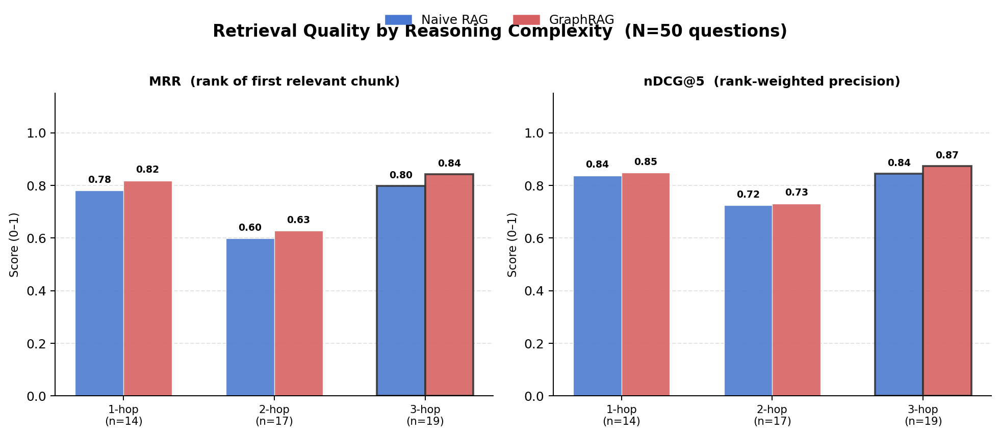
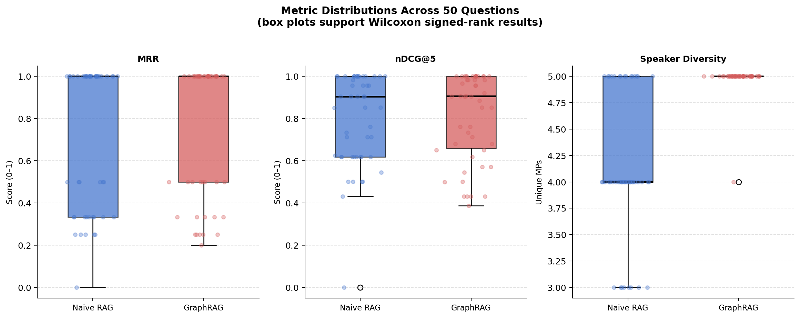

# GraphRAG for Multi-Hop Parliamentary Reasoning

A solo MSc Data Science project exploring whether graph-guided retrieval improves question answering over UK parliamentary Brexit speeches when the question requires evidence across several speakers, parties, topics or time periods.

The project compares a strong hybrid RAG baseline with a GraphRAG pipeline built around a speaker-party-topic-year knowledge graph. The goal was not to assume that GraphRAG would be better, but to test where the extra structure helps and where it does not.



## Project at a glance

- **39,423** Brexit-related parliamentary speeches used in the full experiment
- **201,131** sentence-aware text chunks indexed for retrieval
- **1,806 nodes / 42,634 edges** in the knowledge graph
- **50 evaluation questions** split across 1-hop, 2-hop and 3-hop reasoning
- **7 evaluation metrics** covering retrieval quality, answer quality, faithfulness and diversity
- Local LLM inference through **Ollama** rather than a hosted generation API

## Why this project

Vector search is usually effective when the answer sits in one obvious passage. It is less straightforward when a question asks for a comparison across parties, a change over time, or evidence spanning several debates.

I wanted to test whether explicit relationships between speakers, parties, topics and years could make retrieval more useful for those multi-hop questions. To make the comparison meaningful, the baseline is deliberately competitive rather than a simple vector-only system.

## System design

### 1. Data preparation

The data pipeline filters UK parliamentary speeches to Brexit-related material, normalises speaker names, removes procedural speakers and very short records, and deduplicates exact speech text.

Speeches are then split into overlapping sentence-aware chunks and embedded with `BAAI/bge-small-en-v1.5` for storage in ChromaDB.

### 2. Hybrid RAG baseline

The baseline combines several retrieval signals:

- direct dense retrieval
- HyDE retrieval
- BM25 lexical retrieval
- party-targeted retrieval
- year-aware retrieval
- reciprocal-rank fusion
- cross-encoder reranking
- party-diversity controls

This matters because GraphRAG is being compared against a realistic hybrid retriever, not a weak strawman.

### 3. Knowledge graph

The NetworkX graph represents four main entity types:

- **Speakers**
- **Parties**
- **Topics**
- **Years**

Edges capture membership, topic participation, temporal discussion and repeated co-debate relationships. Topic-speech edges also retain aggregate counts and sentiment information used by the retrieval logic.

### 4. GraphRAG retrieval

The GraphRAG system adds graph structure before final document retrieval. It uses:

- speaker / party / year entity extraction
- semantic topic matching
- weighted graph traversal
- topic-level speaker scoring
- debate-community detection
- bridge-speaker identification
- temporal relevance
- graph-guided candidate retrieval
- graph-score boosting
- iterative retrieve-draft-retrieve logic
- cross-encoder reranking
- final party-diversity controls

The implementation keeps retrieval provenance so retrieved evidence can be traced back to the mechanism that surfaced it.

## Evaluation

The benchmark contains **50 questions** with explicit reasoning-complexity labels:

- **14 one-hop questions**
- **17 two-hop questions**
- **19 three-hop questions**

The evaluation uses MRR, nDCG@5, BERTScore, NLI-based faithfulness,
RAGAS answer relevancy, RAGAS context precision and retrieved-speaker
diversity.

For **MRR and nDCG@5**, relevance is an **entity-based proxy**: a retrieved
chunk is counted as relevant when its speaker or party matches the target
speaker/party set derived for that question. These are therefore not
independently human-judged passage-relevance metrics.

Reference answers were produced using a **TREC-style pooled-reference
procedure**: evidence retrieved by both systems was pooled before a reference
answer was generated. I therefore describe these as *pooled references*, not
independently human-annotated ground truth.

## Results

Across all 50 questions:

| Metric | Hybrid RAG | GraphRAG | Difference |
|---|---:|---:|---:|
| MRR | 0.725 | **0.762** | +0.037 |
| nDCG@5 | 0.801 | **0.818** | +0.017 |
| BERTScore | **0.799** | 0.786 | -0.013 |
| NLI faithfulness | 0.114 | **0.122** | +0.009 |
| Answer relevancy | **0.590** | 0.538 | -0.052 |
| Context precision | 0.446 | **0.462** | +0.016 |
| Speaker diversity | 4.14 | **4.98** | +0.84 MPs |

GraphRAG was numerically higher on **5 of the 7 metrics**. The clearest
GraphRAG-side statistically supported difference was speaker diversity, where
the increase of **0.84 unique MPs per question** was significant under a paired
Wilcoxon signed-rank test (`p < 0.001`).

The hybrid baseline, however, had the higher **BERTScore** (**0.799 vs 0.786**),
and that paired difference was also statistically significant in this
experiment (`p ≈ 0.008`).

MRR and nDCG@5 improved on average, including at the 3-hop level, but those
paired differences were not statistically significant in this 50-question
benchmark. Answer relevancy was also lower for GraphRAG. Together, these
results suggest a trade-off between broader structural coverage and some
answer-similarity/relevancy measures rather than a uniform improvement.



More detail is in [`results/RESULTS.md`](results/RESULTS.md).

## Repository structure

```text
graphrag-parliamentary-reasoning/
├── src/
│   ├── 01_data_loading.py
│   ├── 02_vectorisation.py
│   ├── 03_knowledge_graph.py
│   ├── 04_naive_rag.py
│   ├── 05_graphrag.py
│   ├── 06_generate_pooled_references.py
│   └── 07_evaluation.py
├── data/
│   ├── questions.json
│   ├── parlspeech_brexit_sample_50.csv
│   └── README.md
├── results/
│   ├── evaluation_results.json
│   ├── aggregate_metrics.csv
│   ├── metrics_by_hop.csv
│   └── RESULTS.md
├── figures/
│   └── evaluation figures
├── scripts/
│   └── make_figures.py
├── docs/
│   ├── METHODOLOGY.md
│   └── REPRODUCIBILITY.md
├── requirements.txt
├── .gitignore
├── LICENSE
└── README.md
```

## Running the project

The project was developed with Python 3.10+.

```bash
python -m venv .venv

# Windows
.venv\Scripts\activate

# macOS / Linux
source .venv/bin/activate

pip install -r requirements.txt
```

The retrieval and generation stages use local Ollama models:

```bash
ollama pull qwen2.5:3b
ollama pull phi3:mini
```

NLTK resources used by preprocessing/evaluation may also need to be installed once:

```python
import nltk
nltk.download("punkt")
nltk.download("punkt_tab")
nltk.download("stopwords")
```

After obtaining the source ParlSpeech data described in [`data/README.md`](data/README.md), run the pipeline in order:

```bash
python src/01_data_loading.py
python src/02_vectorisation.py
python src/03_knowledge_graph.py
python src/04_naive_rag.py
python src/05_graphrag.py
python src/06_generate_pooled_references.py
python src/07_evaluation.py
python scripts/make_figures.py
```

Some stages are computationally expensive. Vectorisation, graph construction and the full 50-question evaluation are intended as offline experiment stages rather than interactive commands.

## What I would change next

There are several obvious extensions rather than pretending this experiment settles the GraphRAG question:

- replace the entity-based MRR/nDCG relevance proxy with independently human-annotated passage-relevance judgements
- expand the question set and run repeated evaluation with additional LLM judges
- ablate individual graph components to measure which ones actually drive the gains
- replace lightweight sentiment proxies with task-specific stance representations
- test the same retrieval design on a non-political corpus to separate domain effects from graph effects

## Notes on political content

The project analyses parliamentary speech as a retrieval and information-retrieval benchmark. It does not assign political recommendations or endorsements. Generated answers are experimental outputs and should not be treated as authoritative summaries of political history without checking the underlying source material.

## Author

**Ronit Bulani**  
MSc Data Science, Lancaster University

## Licence

Code in this repository is released under the MIT Licence. Third-party datasets, model weights and parliamentary source material remain subject to their own licences and terms.
